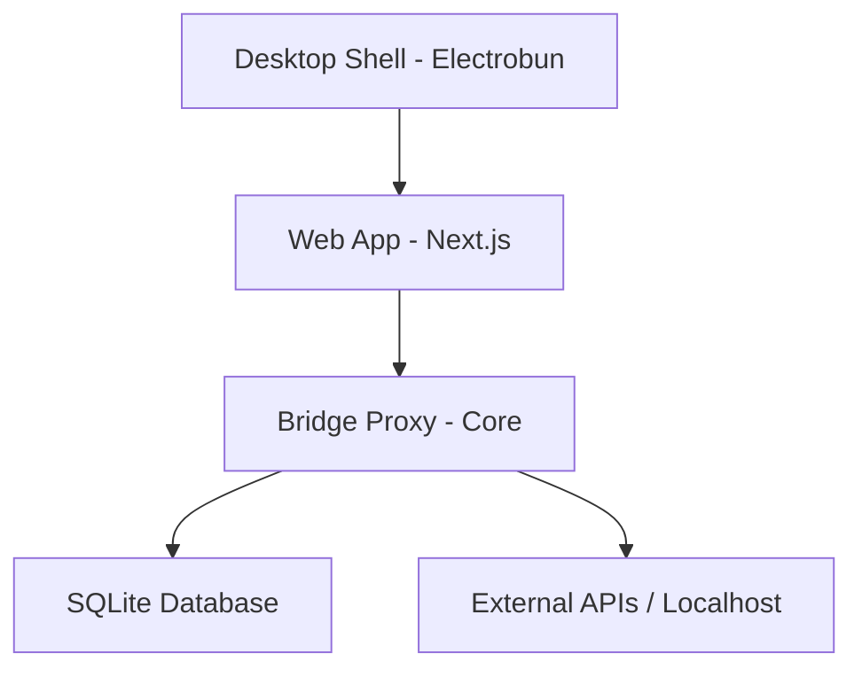

# ᯓ➤ Licht

**Licht** is a high-performance web-to-local bridge designed for modern API development. It provides a sleek, Postman-like interface that connects directly to your local machine, allowing you to bypass CORS restrictions and interact with local services with zero friction.


## ✨ Features

- 🚀 **High-Performance Proxy**: A local Hono-powered engine that handles your requests with minimal overhead.
- 🎨 **Premium UI/UX**: Built with Tailwind CSS v4, Base UI, and GSAP for buttery-smooth animations and a professional dark aesthetic.
- 🔐 **Environment Management**: Securely store and switch between variables (e.g., `{{API_URL}}`).
- 🕒 **Request History**: Full persistence of your request history via a local SQLite database.
- 🛠️ **Desktop App**: A native shell powered by **Electrobun** for a dedicated development experience.
- 🔗 **Query Params & Headers**: Intuitive management of request metadata with real-time URL synchronization.

## 🏗️ Architecture

Licht is built as a monorepo, ensuring a clean separation between the core logic, the web interface, and the desktop shell.



- **`apps/web`**: The Next.js frontend.
- **`apps/core`**: The backend proxy and API server (Bun + Hono + SQLite).
- **`apps/desktop`**: The Electrobun-based native application.
- **`packages/ui`**: Shared design system and components.

## 🚀 Getting Started

### Prerequisites

- [Bun](https://bun.sh) (v1.0+)
- [Turbo](https://turbo.build) (`npm install -g turbo`)

### Installation

1. Clone the repository:
   ```bash
   git clone https://github.com/yourusername/licht.git
   cd licht
   ```

2. Install dependencies:
   ```bash
   bun install
   ```

### Development

To start the entire stack (Web + Core):
```bash
bun run dev
```

To run the desktop app with HMR:
```bash
bun run dev:desktop
```

### 🛠️ CLI Usage (Core)

The core engine provides a CLI for manual control and initialization.

1. **Initialize** the workspace:
   ```bash
   licht init
   ```

2. **Start** the Bridge Proxy:
   ```bash
   licht start
   ```

Once the proxy is running, it will listen on `http://127.0.0.1:4317` and be ready to handle requests from the Web UI or Desktop App.

## 🛠️ Tech Stack

- **Frontend**: Next.js 16, Tailwind, GSAP, Phosphor Icons.
- **Backend**: Bun, Hono, Better-SQLite3.
- **Desktop**: Electrobun.

## 📜 License

MIT &copy; [Dominik Krakowiak](https://github.com/th11n)